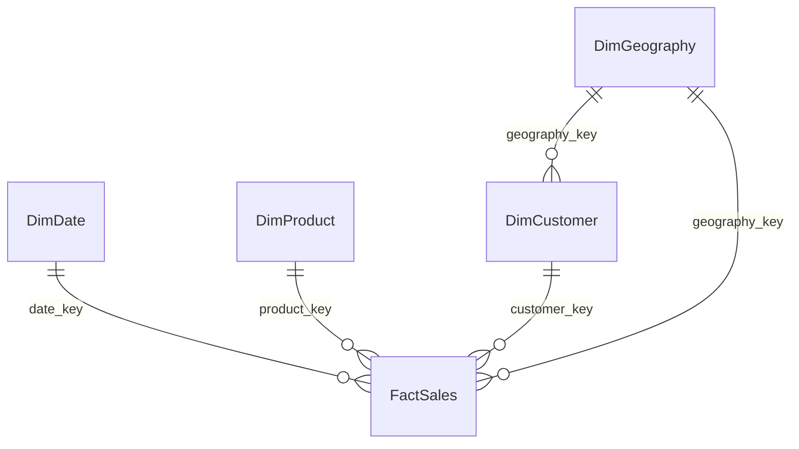

# DSA 2040 Practical Exam – Retail Data Warehouse

## Overview
This project builds a comprehensive star‑schema data warehouse from the provided `raw_data/Online Retail.xlsx` dataset (classic UCI Online Retail). It supports analytics:
- Sales by product category per quarter
- Customer demographic & geographic trends
- Inventory movement proxy (net units sold)
- Return analysis (credit / negative lines)

## Star Schema Design

### Grain
One row in the fact table = one invoice line (InvoiceNo + StockCode) at the time of sale or return.

### Tables Structure
- **Fact Table**: `FactSales` – transactional measures
- **Dimensions**: `DimDate`, `DimProduct`, `DimCustomer`, `DimGeography`
- **Degenerate Dimension**: `invoice_no` kept in the fact (no separate dimension)

### Fact Measures & Flags
- `quantity` (negative = return)
- `unit_price`
- `sales_amount` = quantity * unit_price (negative for returns)
- `sales_amount_abs` = ABS(sales_amount)
- `is_return` (0/1)

### Handling Returns & Missing Data
- Returns: Negative quantity preserved; flag simplifies filtering.
- Missing CustomerID: Mapped to surrogate anonymous row (customer_key = 0).
- Product Category: Default 'Unknown' until enriched.
- Geography Denormalization: `geography_key` copied to fact for faster slicing.

### ASCII Schema Diagram
```
                 +------------------+
                 |    DimDate       |
                 |------------------|
                 | date_key (PK)    |
                 | full_date        |
                 | day, month       |
                 | month_name       |
                 | quarter, year    |
                 | week_of_year     |
                 | day_of_week      |
                 | is_weekend       |
                 +---------^--------+
                           |
+------------------+       |      +--------------------+
|   DimProduct     |       |      |    DimCustomer     |
|------------------|       |      |--------------------|
| product_key (PK) |       |      | customer_key (PK)  |
| stock_code       |       |      | customer_id        |
| description      |       |      | customer_name      |
| category         |       |      | gender             |
| subcategory      |       |      | birth_year         |
| unit_of_measure  |       |      | geography_key (FK)-+----+
| first_sale_date_key (FK)-+      | customer_since_date_key |
| is_active        |              | segment            |    |
+---------^--------+              +---------^----------+    |
          |                                 |               |
          |                                 |               |
          |                      +----------+--------+      |
          |                      |   DimGeography    |      |
          |                      |-------------------|      |
          |                      | geography_key (PK)|<-----+
          |                      | country           |
          |                      | region            |
          |                      +-------------------+
          |
                 +----------------------------------------------+
                 |                 FactSales                   |
                 |----------------------------------------------|
                 | fact_sales_key (PK)                         |
                 | date_key (FK)                               |
                 | product_key (FK)                            |
                 | customer_key (FK)                           |
                 | geography_key (FK)                          |
                 | invoice_no (degenerate)                     |
                 | quantity, unit_price                        |
                 | sales_amount, sales_amount_abs              |
                 | is_return                                   |
                 | load_timestamp                              |
                 +----------------------------------------------+
```

### Mermaid (optional)


### Why Star Schema (vs Snowflake)
Star keeps queries simple & fast (fewer joins) for BI aggregations. Snowflake would save small storage by normalizing categories/geography but slow common rollups and add complexity.

## SQLite DDL

```sql
PRAGMA foreign_keys = ON;

-- Dimension: Date
CREATE TABLE DimDate (
    date_key             INTEGER PRIMARY KEY,
    full_date            DATE NOT NULL,
    day                  INTEGER NOT NULL CHECK(day BETWEEN 1 AND 31),
    month                INTEGER NOT NULL CHECK(month BETWEEN 1 AND 12),
    month_name           TEXT NOT NULL,
    quarter              INTEGER NOT NULL CHECK(quarter BETWEEN 1 AND 4),
    year                 INTEGER NOT NULL,
    week_of_year         INTEGER,
    day_of_week          INTEGER CHECK(day_of_week BETWEEN 1 AND 7),
    is_weekend           INTEGER NOT NULL CHECK(is_weekend IN (0,1))
);
CREATE INDEX idx_dimdate_year_quarter ON DimDate(year, quarter);
CREATE INDEX idx_dimdate_full_date ON DimDate(full_date);

-- Dimension: Geography
CREATE TABLE DimGeography (
    geography_key    INTEGER PRIMARY KEY,
    country          TEXT NOT NULL,
    region           TEXT
);
CREATE UNIQUE INDEX uq_dimgeog_country_region ON DimGeography(country, IFNULL(region,''));

-- Dimension: Product
CREATE TABLE DimProduct (
    product_key            INTEGER PRIMARY KEY,
    stock_code             TEXT NOT NULL,
    description            TEXT,
    category               TEXT NOT NULL DEFAULT 'Unknown',
    subcategory            TEXT,
    unit_of_measure        TEXT NOT NULL DEFAULT 'each',
    first_sale_date_key    INTEGER,
    is_active              INTEGER NOT NULL DEFAULT 1 CHECK(is_active IN (0,1)),
    FOREIGN KEY (first_sale_date_key) REFERENCES DimDate(date_key)
);
CREATE UNIQUE INDEX uq_dimproduct_stock_code ON DimProduct(stock_code);
CREATE INDEX idx_dimproduct_category ON DimProduct(category);
CREATE INDEX idx_dimproduct_category_subcat ON DimProduct(category, subcategory);

-- Dimension: Customer
CREATE TABLE DimCustomer (
    customer_key              INTEGER PRIMARY KEY,
    customer_id               INTEGER,
    customer_name             TEXT,
    gender                    TEXT,
    birth_year                INTEGER,
    geography_key             INTEGER NOT NULL,
    customer_since_date_key   INTEGER,
    segment                   TEXT NOT NULL DEFAULT 'Retail',
    FOREIGN KEY (geography_key) REFERENCES DimGeography(geography_key),
    FOREIGN KEY (customer_since_date_key) REFERENCES DimDate(date_key)
);
CREATE UNIQUE INDEX uq_dimcustomer_customer_id ON DimCustomer(customer_id);
CREATE INDEX idx_dimcustomer_geog ON DimCustomer(geography_key);
CREATE INDEX idx_dimcustomer_segment ON DimCustomer(segment);

-- Fact: Sales (Invoice Line)
CREATE TABLE FactSales (
    fact_sales_key    INTEGER PRIMARY KEY,
    date_key          INTEGER NOT NULL,
    product_key       INTEGER NOT NULL,
    customer_key      INTEGER NOT NULL,
    geography_key     INTEGER NOT NULL,
    invoice_no        TEXT NOT NULL,
    quantity          INTEGER NOT NULL,
    unit_price        NUMERIC NOT NULL,
    sales_amount      NUMERIC NOT NULL,
    sales_amount_abs  NUMERIC NOT NULL,
    is_return         INTEGER NOT NULL CHECK(is_return IN (0,1)),
    load_timestamp    DATETIME NOT NULL DEFAULT (datetime('now')),
    FOREIGN KEY (date_key) REFERENCES DimDate(date_key),
    FOREIGN KEY (product_key) REFERENCES DimProduct(product_key),
    FOREIGN KEY (customer_key) REFERENCES DimCustomer(customer_key),
    FOREIGN KEY (geography_key) REFERENCES DimGeography(geography_key)
);
CREATE INDEX idx_factsales_date ON FactSales(date_key);
CREATE INDEX idx_factsales_product_date ON FactSales(product_key, date_key);
CREATE INDEX idx_factsales_customer_date ON FactSales(customer_key, date_key);
CREATE INDEX idx_factsales_geog_date ON FactSales(geography_key, date_key);
CREATE INDEX idx_factsales_invoice ON FactSales(invoice_no);

-- Integrity triggers
CREATE TRIGGER trg_factsales_before_insert
BEFORE INSERT ON FactSales
FOR EACH ROW
BEGIN
  SELECT CASE WHEN NEW.sales_amount != NEW.quantity * NEW.unit_price
    THEN RAISE(ABORT,'sales_amount must equal quantity * unit_price') END;
  SELECT CASE WHEN NEW.sales_amount_abs != ABS(NEW.sales_amount)
    THEN RAISE(ABORT,'sales_amount_abs must equal ABS(sales_amount)') END;
  SELECT CASE WHEN (NEW.quantity < 0 AND NEW.is_return = 0)
    OR (NEW.quantity > 0 AND NEW.is_return = 1)
    THEN RAISE(ABORT,'is_return inconsistent with quantity sign') END;
END;

CREATE TRIGGER trg_factsales_before_update
BEFORE UPDATE ON FactSales
FOR EACH ROW
BEGIN
  SELECT CASE WHEN NEW.sales_amount != NEW.quantity * NEW.unit_price
    THEN RAISE(ABORT,'sales_amount must equal quantity * unit_price') END;
  SELECT CASE WHEN NEW.sales_amount_abs != ABS(NEW.sales_amount)
    THEN RAISE(ABORT,'sales_amount_abs must equal ABS(sales_amount)') END;
  SELECT CASE WHEN (NEW.quantity < 0 AND NEW.is_return = 0)
    OR (NEW.quantity > 0 AND NEW.is_return = 1)
    THEN RAISE(ABORT,'is_return inconsistent with quantity sign') END;
END;
```

## Example Analytical Queries

Sales by category per quarter:
```sql
SELECT d.year, d.quarter, p.category,
       SUM(f.sales_amount) AS total_sales
FROM FactSales f
JOIN DimDate d ON f.date_key = d.date_key
JOIN DimProduct p ON f.product_key = p.product_key
WHERE f.is_return = 0
GROUP BY d.year, d.quarter, p.category
ORDER BY d.year, d.quarter, p.category;
```

Return rate by category:
```sql
SELECT p.category,
       SUM(CASE WHEN f.is_return=1 THEN -f.quantity ELSE 0 END) AS units_returned,
       SUM(CASE WHEN f.is_return=0 THEN f.quantity ELSE 0 END) AS units_sold,
       ROUND(1.0 * SUM(CASE WHEN f.is_return=1 THEN -f.quantity ELSE 0 END) /
             NULLIF(SUM(CASE WHEN f.is_return=0 THEN f.quantity ELSE 0 END),0), 4) AS return_rate
FROM FactSales f
JOIN DimProduct p ON f.product_key = p.product_key
GROUP BY p.category
ORDER BY return_rate DESC;
```

Geography sales:
```sql
SELECT g.country, d.year, d.quarter, SUM(f.sales_amount) AS net_sales
FROM FactSales f
JOIN DimDate d ON f.date_key = d.date_key
JOIN DimGeography g ON f.geography_key = g.geography_key
GROUP BY g.country, d.year, d.quarter
ORDER BY g.country, d.year, d.quarter;
```

## ETL Outline
1. Extract Excel to pandas.
2. Clean & standardize fields; mark returns.
3. Build dimension surrogate key maps.
4. Populate dimensions.
5. Load fact with computed measures.
6. Run validation checks.

Notebook: `data_warehouse_notebook/retail_data_warehouse.ipynb` contains executable build.

Folder Rename Note: The original `notebooks/` directory has been migrated to `data_warehouse_notebook/` for clearer naming. The legacy folder is temporarily retained (with the original copies and generated artifacts like figures / `retail_dw.db`) until you confirm cleanup. Let me know if you would like the old folder removed or the database / figures also relocated.

## How to Run (Windows cmd)
```cmd
python -m venv .venv
.venv\Scripts\activate
pip install pandas openpyxl notebook
jupyter notebook
```
Open the notebook and Run All.

## Next Enhancements
- SCD Type 2 support for changing product/category
- Separate purchase/inventory facts for true stock snapshots
- Data quality audit & anomaly detection

## License
See `LICENSE`.

